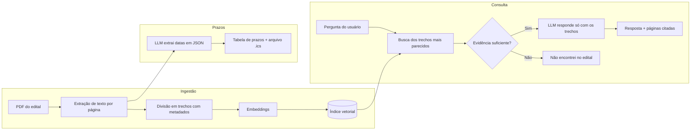

# EditalClaro — assistente de editais com IA

Um assistente conversacional que responde dúvidas sobre editais (concursos, vestibulares, bolsas) **citando a página de onde tirou cada informação** e organiza automaticamente os **prazos e datas** em uma lista que pode ser exportada para o calendário.

> ⚠️ Projeto educacional. Sempre confirme datas e regras no edital oficial antes de tomar qualquer decisão.

---

## 📌 Sobre o projeto

Editais são documentos longos, cheios de regras, exceções e cronogramas espalhados em várias seções. Perder um prazo ou não perceber um requisito pode custar uma vaga. O problema não é falta de informação, e sim a dificuldade de **encontrar rápido o trecho certo** e **não deixar nenhuma data escapar**.

O EditalClaro combina duas ideias:

1. **Perguntas e respostas fundamentadas:** o usuário pergunta em linguagem natural e o agente responde usando apenas trechos do edital, indicando a página.
2. **Painel de prazos:** o sistema extrai do edital as datas importantes (inscrição, pagamento, provas, resultado, recursos) e mostra tudo em uma tabela, com opção de exportar para o calendário.

Se a informação não estiver no documento, o agente diz isso claramente em vez de inventar uma resposta.

---

## ✨ Funcionalidades

- 💬 Chat com perguntas em linguagem natural sobre o edital
- 📄 Resposta com **citação de página** e do trecho usado
- 🚫 Resposta "não encontrei no edital" quando a evidência é fraca
- 📅 **Painel de prazos** com evento, data e página de origem
- 🗓️ Exportação dos prazos em arquivo `.ics` (Google Agenda, Outlook etc.)
- 📊 Script de avaliação para medir a qualidade da busca

---

## ⚙️ Como funciona



**Passo a passo**

1. O PDF é lido página por página, preservando o número da página.
2. O texto é dividido em trechos pequenos que guardam de qual página vieram.
3. Cada trecho vira um vetor (embedding) e é salvo em um índice local.
4. A pergunta do usuário também vira vetor, e os trechos mais próximos são recuperados.
5. Se a similaridade ficar abaixo de um limite, o agente avisa que não achou a informação.
6. Caso contrário, os trechos vão como contexto para o LLM, com a instrução de responder **somente** com base neles e citar as páginas.
7. Em paralelo, uma etapa separada pede ao LLM para devolver as datas do edital em formato estruturado (JSON), que alimenta o painel de prazos.

---

## 🧠 Decisões de projeto

| Decisão | Motivo |
|---|---|
| Guardar a página em cada trecho | Permite citar a fonte e o usuário conferir no PDF |
| Limite mínimo de similaridade | Evita respostas inventadas quando o edital não cobre o assunto |
| Extração de prazos em etapa própria | Datas exigem precisão; tratar separadamente reduz erros |
| Saída em JSON validada | Impede que uma data mal formatada quebre a tabela ou o `.ics` |
| Embeddings via API (não locais) | Mantém a VM gratuita da nuvem leve, com pouca memória disponível |
| Aviso de conferência no rodapé | Editais têm consequências reais; o sistema é apoio, não fonte oficial |

---

## 🛠️ Tecnologias utilizadas

| Categoria | Tecnologia |
|---|---|
| Linguagem | Python 3.10+ |
| Leitura de PDF | PyMuPDF (mantém o número da página) |
| Modelo de linguagem (LLM) | Google Gemini (modelo Flash, configurável no `.env`) |
| Embeddings | Google Gemini (`gemini-embedding-001`) |
| Índice vetorial | FAISS (local) |
| Interface | Gradio |
| Validação e calendário | pydantic e ics |
| Gerenciamento de variáveis sensíveis | python-dotenv |
| Controle de versão | Git & GitHub |
| Deploy | Oracle Cloud Infrastructure (OCI Compute) com systemd |

---

## ❓ Exemplos de perguntas e respostas

**Edital usado nos testes:** `<nome do edital, órgão e ano>`

> 📝 Os textos abaixo mostram o **formato** das respostas. Substitua os valores entre colchetes pelos resultados reais dos seus testes antes de publicar.

**Pergunta:** Qual o prazo final para pagar a taxa de inscrição?

**Resposta:** O pagamento da taxa pode ser feito até **[data]**. *(fonte: p. [X])*

**Pergunta:** Quais documentos preciso enviar na matrícula?

**Resposta:** Segundo o edital, são exigidos: [lista de documentos]. *(fontes: p. [X] e p. [Y])*

**Pergunta:** Qual será o valor do salário/da bolsa após a aprovação?

**Resposta:** Não encontrei essa informação no edital. *(o agente reconhece quando o documento não cobre o assunto, evitando respostas inventadas)*

**Painel de prazos (exemplo de saída):**

| Evento | Data | Página |
|---|---|---|
| [Início das inscrições] | [dd/mm/aaaa] | [X] |
| [Fim das inscrições] | [dd/mm/aaaa] | [X] |
| [Prova] | [dd/mm/aaaa] | [X] |

---

## 📂 Estrutura do projeto

```
editalclaro/
├── app.py                 # interface (chat + painel de prazos)
├── src/
│   ├── ingestao.py        # lê o PDF, cria trechos e o índice
│   ├── busca.py           # recupera trechos e aplica o limite de similaridade
│   ├── resposta.py        # monta o prompt e chama o LLM
│   ├── prazos.py          # extrai datas e gera o .ics
│   └── prompts.py         # instruções usadas nos prompts
├── data/
│   └── editais/           # PDFs dos editais
├── avaliacao/
│   ├── perguntas.csv      # perguntas de teste com página esperada
│   └── avaliar.py         # calcula a taxa de acerto da busca
├── deploy/
│   └── editalclaro.service  # serviço systemd usado na OCI
├── screenshots/           # imagens da demonstração e do deploy
├── requirements.txt
├── .env.example           # modelo do arquivo de variáveis (sem chave real)
├── .gitignore
└── README.md
```

---

## ▶️ Instruções para executar localmente

### Pré-requisitos

- Python 3.10 ou superior instalado
- Uma chave de API gratuita do Google Gemini ([obter aqui](https://aistudio.google.com/apikey))

### Passo a passo

```bash
# 1. Clone o repositório
git clone https://github.com/<seu-usuario>/editalclaro.git
cd editalclaro

# 2. Crie e ative um ambiente virtual
python -m venv .venv
# Windows:
.\.venv\Scripts\activate
# Linux/Mac:
source .venv/bin/activate

# 3. Instale as dependências
pip install -r requirements.txt

# 4. Configure sua chave de API
cp .env.example .env
# edite o .env e preencha: GOOGLE_API_KEY=sua_chave_aqui

# 5. Processe o edital (gera o índice vetorial)
python src/ingestao.py data/editais/meu_edital.pdf

# 6. Execute a aplicação
python app.py
```

A aplicação abrirá em `http://localhost:7860`.

---

## 🎥 Demonstração da aplicação


---

## ☁️ Aplicação em produção (Oracle Cloud Infrastructure)

A aplicação está publicada em uma VM (Compute Instance) na OCI, rodando de forma permanente via `systemd`.

🔗 **Acesse a aplicação:** `http://<IP-PUBLICO>:7860`


**Detalhes técnicos do deploy:**

- Instância: `<shape da instância>` (Always Free Tier)
- Sistema operacional: Ubuntu `<versão>`
- Região: `<sua região>`
- A aplicação roda como serviço systemd (`editalclaro.service`), reiniciando automaticamente em caso de falha

**Como reproduzir o deploy**

1. Crie a instância Compute (Ubuntu) e libere a porta `7860` na *Security List* (ou NSG) da sua VCN.
2. Conecte por SSH, instale Python e clone o repositório.
3. Crie o ambiente virtual, instale as dependências, configure o `.env` e rode a ingestão do edital.
4. Libere a porta também no firewall da própria VM:

```bash
sudo iptables -I INPUT -p tcp --dport 7860 -j ACCEPT
sudo netfilter-persistent save
```

5. No `app.py`, a interface deve escutar em `0.0.0.0` (`server_name="0.0.0.0"`).
6. Instale o serviço:

```ini
# deploy/editalclaro.service
[Unit]
Description=EditalClaro - assistente de editais
After=network.target

[Service]
User=ubuntu
WorkingDirectory=/home/ubuntu/editalclaro
EnvironmentFile=/home/ubuntu/editalclaro/.env
ExecStart=/home/ubuntu/editalclaro/.venv/bin/python app.py
Restart=always

[Install]
WantedBy=multi-user.target
```

```bash
sudo cp deploy/editalclaro.service /etc/systemd/system/
sudo systemctl daemon-reload
sudo systemctl enable --now editalclaro
sudo systemctl status editalclaro
```

---

## 📊 Avaliação

Em `avaliacao/perguntas.csv` ficam perguntas de teste com a página onde a resposta está. O script `avaliar.py` mede em quantas delas a página correta aparece entre os trechos recuperados (taxa de acerto da busca). Isso permite comparar mudanças, como tamanho dos trechos ou limite de similaridade, com números em vez de impressões.

---

## ⚠️ Limitações

- PDFs escaneados (imagem) precisam de OCR antes do processamento.
- Tabelas complexas podem perder a formatação na extração de texto.
- O modelo pode errar na interpretação; por isso a página é sempre citada para conferência.
- O projeto não substitui a leitura do edital oficial nem orientação profissional.

---

## 🚀 Próximos passos

- [ ] Suporte a vários editais ao mesmo tempo
- [ ] Comparação entre dois editais
- [ ] Busca híbrida (semântica + palavras-chave)
- [ ] OCR para PDFs escaneados
- [ ] Lembretes automáticos de prazos

---

## 🙏 Inspiração e créditos

A ideia geral de usar RAG para conversar com um documento institucional foi inspirada no repositório `agente-rag-stanford`, de Thiago Ribeiro Silva. Este projeto trata de outro problema (editais e prazos) e tem domínio, funcionalidades e documentação próprios.

---

## 👤 Autor

**<Livian Cristina Carvalho>** 

Projeto desenvolvido para a trilha ONE (Oracle Next Education) — AI Tech Builder, Alura/Oracle.
